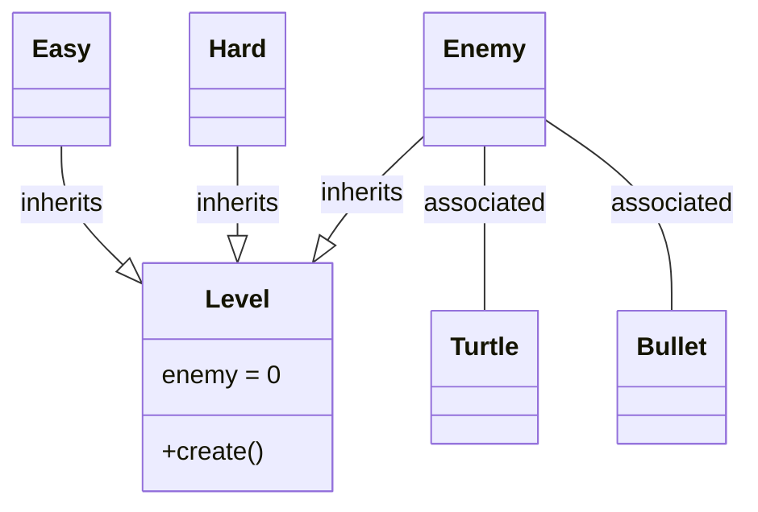
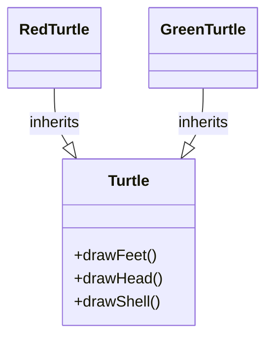
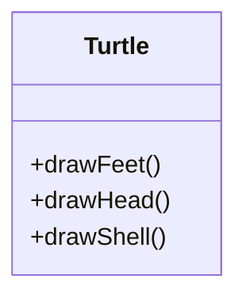
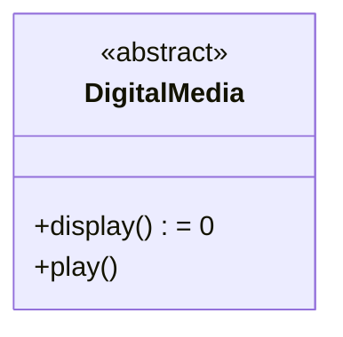

**Factory Method Design Pattern**
Encapsulates object creation rules which can be changed dynamically (at runtime)

**Note 1**: There's a design pattern called Abstract Factory, so use full name, not just "Factory". 

**Note 2**: Also known as "virtual constructor" design pattern 

**Note 3**: C++ virtual constructor idiom 
=> virtual create = default constructor
=> virtual clone = copy constructor 

e.g., Video Game where "easy" level creates 70% turtles and 30% bullets; "hard" creates 70% bullets and 30% turtles

Level 
\+ create();
	Enemy = 0;
$\leftarrow$ Easy, Hard 

Level $\leftarrow$ Enemy (Turtle, and Bullet)




// Encapsulating creation 
```C++
class Enemy { 
...
public:
	virtual ~Enemy() = 0;
};

class Turtle : public Enemy {
...

};

class Level {
public:
	virtual Enemy* create() = 0;
	virtual ~Level();
};

class Easy : public Level {
public:
	virtual Enemy* create() override {
		// create according to rules
	}
};

int main() {

	Level *lv = new Easy;
	Enemy *e = lev->create;
	delete lev;
	lev = new Hard;

	return 0;
}
```


**Template Method Design Pattern**
Used for an algorithm where some of the steps can be customized 

FreshKit
\+ create() userid
\+ letterFromPrez()
\+ firstNetwork();

e.g., Turtle::draw calls drawHead, drawFeet, drawShell. Subclasses RedTurtle/GreenTurtle, change the shell colour for draw shell 



Question: What happens if all methods are public and virtual?
Answer: can't enforce draw algorithm and subclasses can re-define all of the methods, possibly violating class assertions and invariants. 


Having 2 Competing Ideas:
- public methods => UI contract
- virtual methods => subclass classes can override i.e. change behaviour 
Template Method makes only the "algorithm" method public (and non virtual). The "steps" are provided or private 



**Template Method uses the Non-Virtual Interface Idiom (NVI)**
The NVI idiom states: only non-virtual methods (except destructors) can be public
- virtual methods are private or protected 
- each virtual method "unwrapped/called" by a public method 

e.g., Consider a DigitalMedia class with a virtual private "doPlay" method called the public "play" method



```C++
void DigitalMedia::play() {
	doPlay();
}
```
- can add actions before or after the "doPlay", without affecting client code 
- choose what you give client access too
- reasonably efficient

- cost is extra method call, but a good compiler can optimizer this 
- no downsides!
- let us maintain control over what the client can use 

**STL std::map**
- import/include \<map\>
- consists of std::pair (\<utility\>) key and value tuple 
- usually implemented using red-black tress (CS240)
- key must be unique and either provide operator< or a comparator function
- iteration is in key order 

e.g., 
```C++
std::map<int, std::string> students; // empty
students[123] = "Kenneth Zhang";

// if it's not there, doing something appropriate ... 
if (students.count(123) == 0) { ... ; }

// given a pair (key, value)-tuple 's'
for (auto s : students) {
	cout << s.first << "\t" << s.second << endl;
}

// [key, value] is structured binding C++20
for (auto [key, value] : student) {
	cout << key << "\t" << value << endl;
}

students.erase(123);
```


- structured bindings work on structs where all data fields are public
e.g., 
```C++
Vec v{1, 2}; // assume all fields are public
auto [x, y] = v; // x = 1, y = 2

// also words on stack allocated arrays of known size
int a[] = {1, 2, 3};
auto[x, y, z] = a; // x = 1, y = 2, z = 3
```

What goes into a C++20 Module?
- so far we've had 1 class per module 
- But since each module can contain multiple classes and functions, we need a different way to decide
- We will introduce 2 measures of software design, coupling and cohesion
- coupling is a measure of how strongly distinct program modules depend upon 
- low: communicate by passing simple parameter values
	- pass arrays/structs 
	- can affect the other's control flow 
	- share global data 
	- know each other's implementation details => friends 

Goal is to have low coupling.


