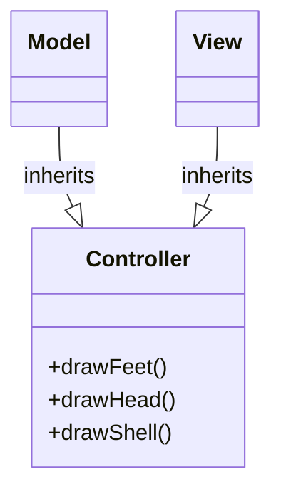

**High Coupling**
- changes to one module will cause changes to other
- makes re-use difficult

**Cohesion**
- measure of how closely related module's components are

Low-completely unrelated e.g., \<utility\>
- thematically linked (overarching) e.g., \<algorithms\> library
- manipulate over the lifetime of the object e.g., open/read/close files 
- pass information to each other 
- cooperate to perform a single task 

**Low Cohesion**
- poorly organized code
- hard to maintain and re-use 

**Ideal**: Modules have low coupling and high cohesion 

Question: What happens if 2 classes depend upon each other?
e.g.,
```C++
class A {
	int x;
	B y;
};

class B {
	char x;
	A y;
};
```

Not possible in C++ since have dependency cycle.
- need to forward declare one of the two classes, and
- make the data field something with a known size e.g., pointer or reference

e.g., 
```C++
class B;
class A {
	int x;
	B *y;
};

class B {
	char x;
	A y;
};
```

Question: When do we need to import/include the interface file for some class C?
Answer:
```C++
class D {
	C c; // must know size of c
	...
};
```

```C++
class D : public C {
	...
};
```
- Use C in inline code, pass/return by value 
- if classes are that tightly coupled, place in same module 
- Remember, modules must be compiled in dependency order. 

Note: one module cannot forward-declare another module or the components of another modules

**Decoupling and MVC**
e.g., chess game 
```C++
class ChessBoard {
	...
	cout << ... ;
	...
};
```

Could change ChessBoard to work with (ostream\*) and (istream\*) to allow customization of I/O sources. But this doesn't handle changing interface from text to graphics. The real problem is that we've made ChessBoard responsible for both modeling game state and interacting with the player.

This violates the Single Responsibility Principle
- give a class only 1 reason to change 
- Leads us to the architectural pattern 
Model View Controller (see CS 344)


- Model: represents "state"
- View: How to interact with client controller :intermediary 
- Optional: make view an observer of the model
	-  i.e. Observer Design Pattern 

**Exception Safety**
Consider:
e.g., 
```C++
void f() {
	C c;
	C *p = new C;
	g();
	delete c;
}
```
- works fine e.g., no memory leak if g() doesn't raise an exception 

Question: What happens if g() does raise an exception?
Answer: Stack unwinding executes destructor for object 'c' but 'p' isn't an object so leak memory

```C++
void f() {
	C c;
	C * = new C;
	try { 
		g();
	} catch ( ... ) {}
	delete p; 
}
```

```C++
void f() {
	C c;
	C *p = new C;
	try {
		g();
	} catch (...) {
		// work
		delete p;
		throw;
	}
	delete p;
}
```

Has duplicate code:
- harder to maintain, greater chance for error 
- Some languages, Java but not C++, have a "finally" clause that contains code to execute no matter how the function terminates. i.e. normally or exception
- Solution is to leverage the fact that stack unwinding executes object destructors 
- Resource Acquisition IS Initialization (RAII)
- a "smart pointer" applies RAII i.e. wraps a pointer in an object whose destructor frees it
- e.g., in C++, `std::unique_ptr<T>` from \<memory\>, stores a `T(*)`

```C++
void f() {
	C c;
	unique_ptr<C> p{new C};
	g();
}
// frees p's contents 
```

e.g., RAII with `ifstream`
```C++
{
	ifstream inf{"input.text"}; // constructor opened the file 
	{
		... inf >> ... ;
	}
	...
} // inf goes out of scope, destructor closes the file 
```
- if we use `unique_ptr` constructor => need new
- `make_unique` takes constructor parameters 
```C++
...
auto p = std::make_unique<C> { /* default constructor */ };
```

Consider:
```C++
std::unique_ptr<C> p{new C};
std::unique_ptr<C> q = p;
```
=> unique_ptr doesn't allow copying i.e. transfers ownership 

Same for passing/returning by vlaue
e.g., 
```C++
void f(std::unique_ptr<C> p); 
// f becomes owner, caller "loses" ownership 
```

e.g., 
```C++
std::unique_ptr<C> g();
// g loses ownership, caller receives it 
```

- only 1 class/function is the owner i.e. has the unique_ptr, while everyone else uses
- passes the raw pointer
- lectures/26_unique_ptr: has a simplified sketch of a unique_ptr implementation that disables copying 

```C++
template<typename T> class unique_ptr {
	T* ptr;
public:
	explicit unique_ptr(T* p) : ptr{p} {}
	~unique_ptr() { delete ptr; }
	unique_ptr(const unique_ptr<T>& o) = delete;
	unique_ptr<T>& operator=(const unique_ptr<T>& o) = delete; 
	
	unique_ptr(unique_ptr<T>&& o) {
		o.ptr = nullptr;
	}
	
	unique_ptr<T>& operator=(unique_ptr<T>&& o) {
		delete ptr;
		ptr = o.ptr;
		o.ptr = nullptr;
		return *this;
	}
	T& operator*() { return *ptr; }
};
```

- an alternative is std::shared_ptr, where last one with knowledge of the pointer is responsible for deleting it
- uses a counter, incremented for every "share" and decremented on every destruction 

e.g., 
```C++
{
	auto p1 = std::make_shared<C>();
	if (...) {
		auto p2 = p1; // copy constructp => 2 pointers in some object 
		...
	} //. p2 out of scope, counter == 1
	...
} // p1 out of scope, frees pointer 
```
- passes the raw